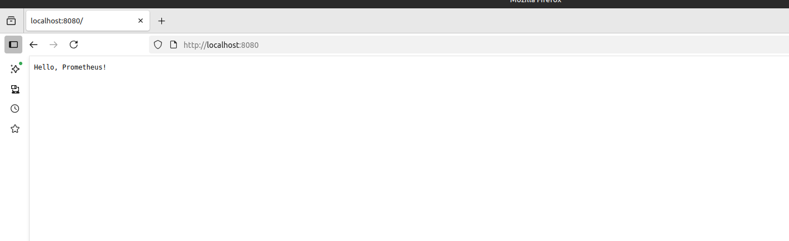
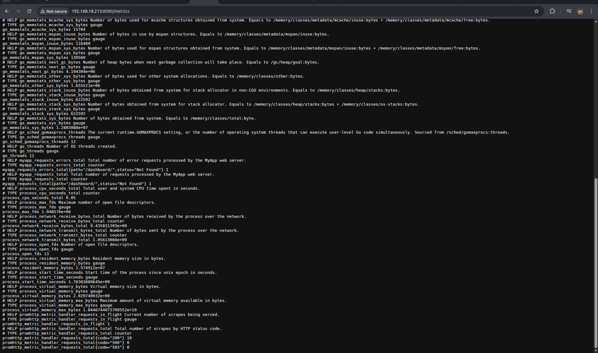
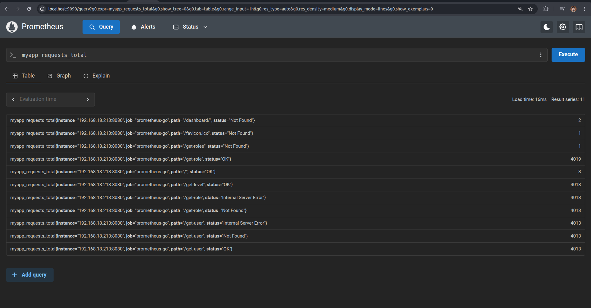
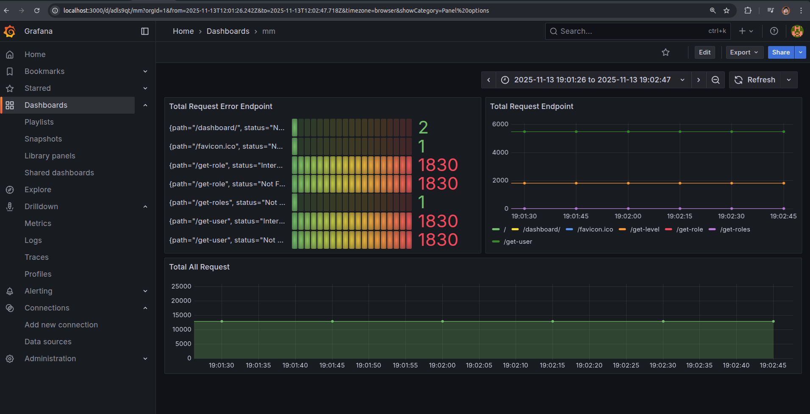

## 🚀 Memulai (Getting Started)

### Prasyarat

Pastikan telah menginstal tool berikut:
1.  **Docker**
2.  **Docker Compose**
2.  **Make**

### 1. Menjalankan prometheus & grafana di dalam docker

```bash
make install-prometheus
```

### 2. Menjalankan applikasi

```bash
make run
```




### 3. Melihat /metrics di applikasi







### 4. result aplikasi  

